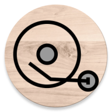
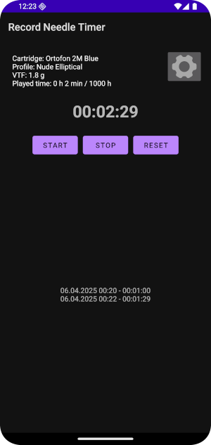
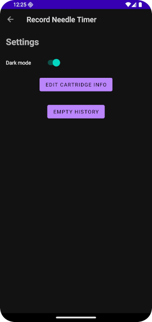
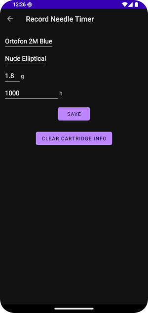

### Record Needle Timer
Android App for logging playtime of record cartridge.

Language support for english and finnish.

## Main features
#### Main view
* Shows your cartridge info (name, profile, VTF, playtime and max usable hours)
* Start timer when you start to play the record and stop timer to add that time to cardridge info playtime
* Can also reset the timer between sessions
* Saves playtime history for every session and shows them under the timer
* Gives warning when max usable playtime is exceeded (note with OK button at bottom and cartridge info turns to red)

#### Settings
* Switch between light and dark mode
* Button to cartridge settings
* Button to reset playtime history

#### Cartridge settings
* Save you cartridge info (name, profile, VTF and max usable hours)
* Button to clear cartridge info
------

  
